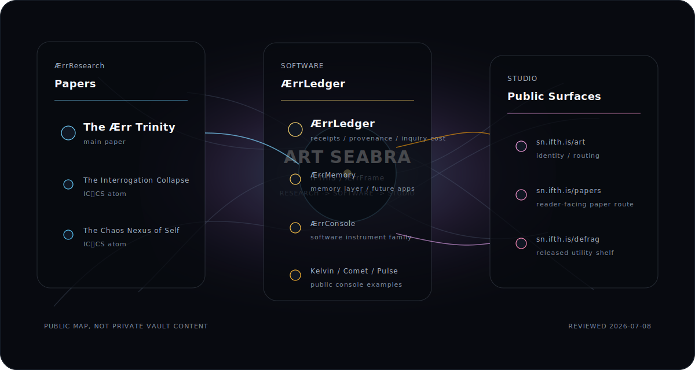

# Art Seabra

Reviewed: 2026-07-08

Founder / scientist / director at **Ifthis**.

Ifthis is still simple: **Research -> Software -> Studio**.

The main offering is the **Ærr principle**. Inside it, the public system tokenizes as **ÆrrFrame**, **ÆrrResearch**, **ÆrrLedger**, **ÆrrMemory**, and **ÆrrConsole**.

  

## Ærr System

| Surface | Function |
| --- | --- |
| **ÆrrFrame** | The organizing principle: inquiry has cost, observation has limits, and substitutes accumulate when the floor is not paid. |
| **ÆrrResearch** | Work produced inside ÆrrFrame: papers, source discipline, claim boundaries, and proof debt made visible. |
| **ÆrrLedger** | The core tool: a multifaceted ledger for provenance, receipts, inquiry accounting, and state transitions. |
| **ÆrrMemory** | The memory layer inside ÆrrLedger; future applications can spin out from this layer without losing provenance. |
| **ÆrrConsole** | The engineering side: public instruments and operator surfaces built by Ifthis Software. |

## Public Work

### ÆrrResearch

| Paper | Public surface | Role |
| --- | --- | --- |
| **The Ærr Trinity** | [paper folder](https://github.com/artseabra/aerr-frame/tree/main/papers/aerr-trinity) | Main paper: cost of inquiry at three orders |
| The Interrogation Collapse | [paper folder](https://github.com/artseabra/aerr-frame/tree/main/papers/ic-cs/the-interrogation-collapse) | IC⏐CS atom: epistemic validity under interrogation |
| The Chaos Nexus of Self | [paper folder](https://github.com/artseabra/aerr-frame/tree/main/papers/ic-cs/the-chaos-nexus-of-self) | IC⏐CS atom: identity as strange attractor |

### Software: ÆrrLedger / ÆrrMemory / ÆrrConsole

| Surface | Public surface | Role |
| --- | --- | --- |
| **ÆrrLedger** | [input sandbox](https://aerrledger.vercel.app/input-sandbox) | Provenance, receipt, and inquiry-accounting instrument |
| **ÆrrMemory** | in development | Memory layer for captured context, source boundaries, and future applications |
| **ÆrrConsole** | public instruments | Engineering family for software surfaces built from the Ærr principle |
| Kelvin Console | [live console](https://kelvin-console-v18-epistemic-horizo.vercel.app) | Chaotic-map visual / sonic instrument |
| Arjen's Comet | [public route](https://kelvin-console-archive.vercel.app/arjens-comet) | Square-root geometry and sonic tracks |
| Pulse | [product page](https://sn.ifth.is/defrag/pulse) | macOS drive-awake utility for media workflows |

### Studio

| Surface | Public surface | Role |
| --- | --- | --- |
| Ifthis / Art | [sn.ifth.is/art](https://sn.ifth.is/art) | Public identity and routing surface |
| Papers | [sn.ifth.is/papers](https://sn.ifth.is/papers) | Reader-facing paper route |
| Defrag | [sn.ifth.is/defrag](https://sn.ifth.is/defrag) | Public shelf for shipped creative utilities |

## Boundary

Public here means inspectable, readable, runnable, or deliberately routed. It does not mean the private vault, unpublished drafts, internal sensor systems, or provenance repos are public dependencies.

The main public research line is **The Ærr Trinity**. The main software line is **ÆrrLedger**. The engineering line is **ÆrrConsole**. The memory line is **ÆrrMemory**.

Website: [sn.ifth.is/art](https://sn.ifth.is/art)
